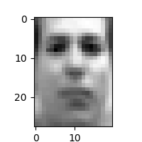

# Introduction

both assignments are done

## 1 Member

Yin Wu, yinwu.life@gmail.com

## Function
a function `def backprop` is defined to help calculate derivative.

base on Perceptron process

```python
f = np.dot(W, x) + b
y = activation(f)
```

the `backprop` is defined as follows

```python
def backprop(y, dy, w, x, b=0, activ=None):
    # y = activ(np.dot(w, x) + b)
    assert activ == 'sigmoid' or activ == 'tanh' or activ == None

    if activ == 'sigmoid':
        df = dy * dsigmoid(y)
    elif activ == 'tanh':
        df = dy * dtanh(y)
    elif activ == 'relu':
        df = dy * drelu(y)
    else:
        df = dy
    
    dw = np.dot(df, x.T)
    dx = np.dot(w.T, df)

    if not isinstance(b, np.ndarray):
        return dw, dx
    else:
        db = np.sum(df, axis=-1, keepdims=True)
        return dw, dx, db
```

# Results

## VAE

the result models are in folder `./vae/results/`

there is also a `txt` file to show the final training output from console.

a random sample result is showed as follows:



## LSTM

the results are saved in `./lstm/results/result.txt` with the text and the output from console

a generated text is also showed as follows:

```
----
 nging;
To breath: then reside and thou'ld who is love
Nay and one and of bed, no further stoo:
For a villain blof,, and took about to still 'sebol-

LORD XETERD:
No! nobrogize, loving blace your writh recress wan,
And all that answer may have for this wear.
So I misunver your misbrit's kiss!
What 'twere mad.

Servant:
I am forgiven news have friends.

KING RICHARD III:
You must tell him to Gooth, let him in; as I virtue,
With fifty queen's doth this gentlemen;
Will sie, thou art thorght of my livar!
Well, why dore the news.

LARTIUS:
Most greeped your worst:
Let with ourself of revenge actior:
I am, vation of I Caril the temp;
And your brother takes a praves as ear,
Had I do pray: being of traush i' the chappy
We enough to be out of love their quepty,
You lives him grown we dear with from beat;
And, as I here, but made him I and my lord
As any than Aumrrer of charge:
Whick not o'erto your couss up in his last,
Of our new my garled by Thie owes;
Say that never gwornest withemp'd of this desire:
Good roves indeed we in any friends,
Ere thou first desious after one.
Why woy's holy dand spake is Marime
Shall have mourn bext watch us were the fixs
Hath proporture its ricktince; why scapt to this
mad my memorio to joupn into against it min:
Do you all; wilringly, or stards a jad;
Oxe wera our called just deceived them among
And full of me? and flower attend; this more
Leble of offend'd he with me.
Durning?

KING RICHARD III:
A proclamm'd to pripore stay's consul'd
In vaces migtled flatter greet, but 'Cuctor.

DUKE VINCENTIO:
AP pleased time, here's thee.

First Citizen:
Even thut orfure vicion than by acter
To see fael'd to care, and make us from Pitter best
I'll prove it wisn, as I came here?

CLARENCE:
Every Richard, June home, bad, you do dow;
I, thou art do's discops before,
I were I name to make me naturably. Even
Where we shall some say that I say,
And sweet with to visa oaclath tomord
Than come prody.

GLOUCESTER:
Dustire is to fight; despiret, that;
Are blessing,  
----
```